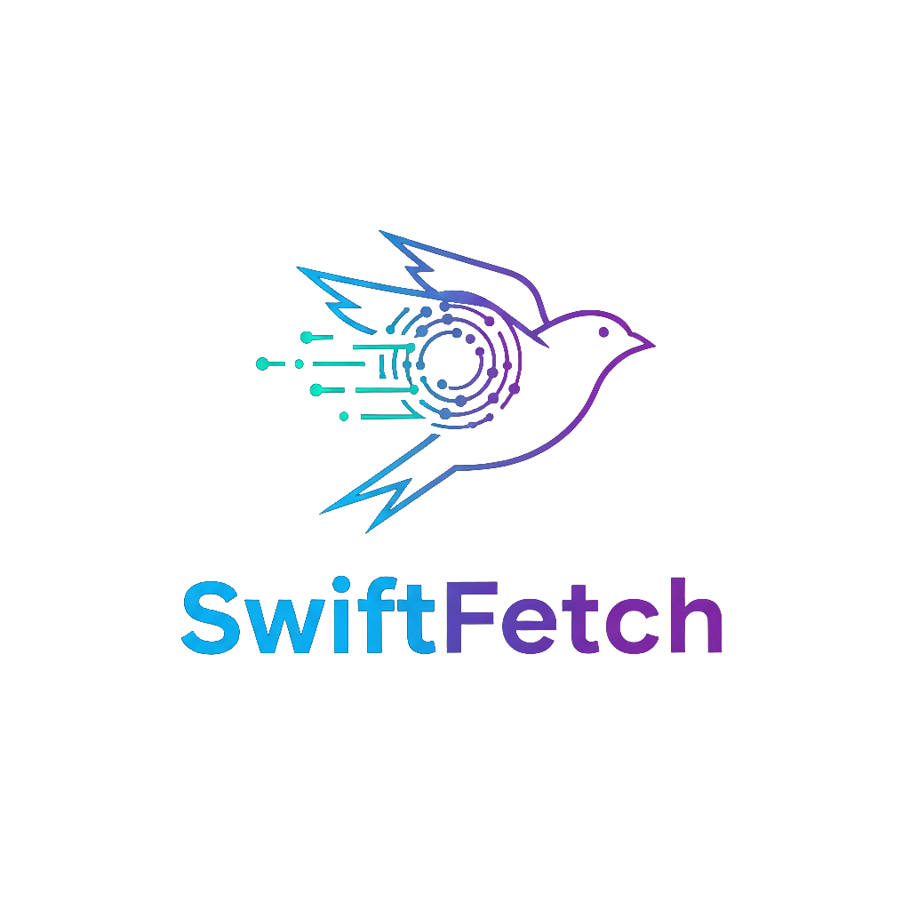

# SwiftFetch

<p align="center">
  
</p>

SwiftFetch is a lightweight, production-ready networking helper built on `URLSession` and Swift Concurrency. It gives you a simple facade to configure a base URL, compose requests, decode JSON, and handle multipart uploads with clear, typed errors.

## Features
- Base URL configuration with default headers
- Typed HTTP method and request/response wrappers
- Async/await networking on top of `URLSession`
- JSON decoding helper with consistent error mapping
- Nested JSON decoding via key path or transform
- Multipart form-data builder for file uploads
- Streaming multipart builder for large payloads
- Opt-in retry policy with backoff
- Optional jitter and custom retry decision hook
- Interceptor pipeline with lightweight logging helper
- Default query params plus per-request timeout/cache overrides
- Metrics hook for timing without dependencies
- Test-friendly design via injectable `URLSession`
- Included `MockFetchClient` for unit tests

## Requirements
- Swift 5.9+
- iOS 15+, macOS 12+, tvOS 15+, watchOS 8+

## Installation
Add SwiftFetch to your `Package.swift` dependencies:
```swift
dependencies: [
    .package(url: "https://github.com/neeteshraj/SwiftFetch.git", from: "1.0.0")
]
```
Then add `SwiftFetch` to your target:
```swift
.target(
    name: "YourApp",
    dependencies: [
        .product(name: "SwiftFetch", package: "SwiftFetch")
    ]
)
```

## Usage Examples

### Configure once (global helper)
```swift
import SwiftFetch

SwiftFetch.configure(
    baseURL: URL(string: "https://api.example.com")!,
    defaultHeaders: ["Authorization": "Bearer <token>"]
)
```

### Prefer instance-based usage (no singleton)
```swift
import SwiftFetch

let api = FetchService(
    baseURL: URL(string: "https://api.example.com")!,
    defaultHeaders: ["Authorization": "Bearer <token>"]
)

let users: [User] = try await api.getJSON("/users")
```

### GET JSON
```swift
struct User: Decodable {
    let id: Int
    let name: String
}

let users: [User] = try await SwiftFetch.getJSON(
    "/users",
    query: ["limit": "20"]
)
```

### POST JSON
```swift
struct CreateUser: Encodable { let name: String }
struct CreatedUser: Decodable { let id: Int; let name: String }

let created: CreatedUser = try await SwiftFetch.postJSON(
    "/users",
    body: CreateUser(name: "Ada")
)
```

### Enable retries (opt-in)
```swift
SwiftFetch.configure(
    baseURL: URL(string: "https://api.example.com")!,
    retryPolicy: .init(
        isEnabled: true,
        maxRetries: 2,
        initialBackoff: 0.2,
        backoffMultiplier: 2.0,
        jitterRange: 0.8...1.2
    )
)
```

### Interceptors (logging example)
```swift
let logger = LoggingInterceptor()
let api = FetchService(
    baseURL: URL(string: "https://api.example.com")!,
    interceptors: [logger]
)
```

### Multipart upload
```swift
var form = MultipartFormData()
form.addField(name: "description", value: "Profile picture")
form.addData(
    name: "file",
    filename: "avatar.jpg",
    mimeType: "image/jpeg",
    data: Data(/* file bytes */)
)

let (body, contentType) = form.build()
let uploadRequest = FetchRequest(
    url: URL(string: "/upload")!,
    method: .post,
    headers: ["Content-Type": contentType],
    body: body
)

let uploadResponse = try await SwiftFetch.client.perform(uploadRequest)
print("Upload status:", uploadResponse.statusCode)
```

## Troubleshooting
- **Relative URL without base:** Call `SwiftFetch.configure` with a base URL before sending relative paths, or `FetchError.invalidURL` is thrown.
- **Non-2xx status:** `FetchError.statusCode(_, data:)` includes the response body to help diagnose server errors.
- **Decoding failures:** `FetchError.decodingFailed` wraps the decoder error—log it to see the exact mismatch.
- **Custom sessions:** Inject a custom `URLSession` via `FetchClient.Configuration` to add caching, auth handling, or `URLProtocol` stubs for testing.

## License
MIT License

